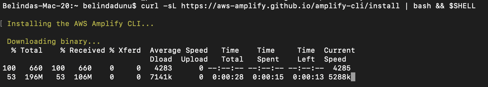

# Building a Fintech App on AWS Using the Plaid API 

Greetings! 

For this project, I'll be showing how we can build and deploy a simple fintech app on Amazon Web Services (AWS), using [Plaid Link Application Programming Interface](https://plaid.com/docs/link/)(API) and the [AWS Amplify](https://aws.amazon.com/amplify/) framework. To make sure it's as user-friendly as possible, we'll be utilizing:

- [React](https://reactjs.org/): Front-end User Interface (UI)
- [Amazon Cognito](https://aws.amazon.com/cognito/): Secure User Sign-Up, Sign-In
- [Amazon API Gateway](https://aws.amazon.com/api-gateway/)––based REST API
- [Amazon DynamoDB](https://aws.amazon.com/dynamodb/): database for storage

[Plaid](https://plaid.com/) a financial services company, helps fintech providers connect users safely to their bank accounts.

## Overview

Open Finance initiatives have been gaining energy across the world. These initiatives require that banks provide fintech companies with secure access to customer data through a common, open API for third-party applications––aka, fintech apps!

Fintech apps can be beneficial in the following ways:

- Viewing balances across multiple bank accounts.
- Sending money to friends.
- Applying for loans without gathering and scanning bank and income statements.
- Paying for things online using a “Buy Now Pay Later” plan.
- Showing monthly income and expense categories to help set budgets.
- Displaying overall investment performance across multiple brokerage accounts.
- Buying crypto-assets.

In most cases, fintech app providers aren't banks; however, they do offer their users access to efficiency and convenience of transactions via smartphone apps. Users can easily link an app to their bank and brokerage accounts, granting the necessary permissions. Apps like these, enhance the customer experience.
 
 

 Let's begin!

 ## Building and Deploying the App

 ### Getting Started

We'll need to confirm that we have the proper accounts and software installed.

1. Create a sandbox account at [Plaid](https://plaid.com/docs/link/).

Click on 'Get API Keys' in order to obtain your API keys and sign-on.

2. Install [AWS Amplify](https://docs.amplify.aws/cli/start/install/).

3. Create an [AWS configuration](https://docs.aws.amazon.com/cli/latest/userguide/cli-configure-quickstart.html#cli-configure-quickstart-config) profile with this command:

    $ aws configure

### Building the App

Clone the following Github repo with these commands:

    $ git clone https://github.com/aws-samples/aws-plaid-demo-app.git

    $ cd aws-plaid-demo-app

Install NPM:

    $ npm install

We'll need to initialize a new Amplify project.

    $ amplify init

Hit **Return** to accept the defaults.

