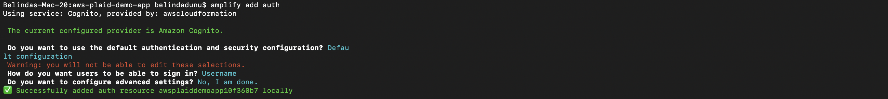

# Building a Fintech App on AWS Using the Plaid API 

Greetings! 

For this project, I'll be showing how we can build and deploy a simple fintech app on Amazon Web Services (AWS), using [Plaid Link Application Programming Interface](https://plaid.com/docs/link/)(API) and the [AWS Amplify](https://aws.amazon.com/amplify/) framework. To make sure it's as user-friendly as possible, we'll be utilizing:

- [React](https://reactjs.org/): Front-end User Interface (UI)
- [Amazon Cognito](https://aws.amazon.com/cognito/): Secure User Sign-Up, Sign-In
- [Amazon API Gateway](https://aws.amazon.com/api-gateway/)––based REST API
- [Amazon DynamoDB](https://aws.amazon.com/dynamodb/): database for storage

[Plaid](https://plaid.com/) a financial services company, helps fintech providers connect users safely to their bank accounts.

## Overview

Open Finance initiatives have been gaining energy across the world. These initiatives require that banks provide fintech companies with secure access to customer data through a common, open API for third-party applications––aka, fintech apps!

Fintech apps can be beneficial in the following ways:

- Viewing balances across multiple bank accounts.
- Sending money to friends.
- Applying for loans without gathering and scanning bank and income statements.
- Paying for things online using a “Buy Now Pay Later” plan.
- Showing monthly income and expense categories to help set budgets.
- Displaying overall investment performance across multiple brokerage accounts.
- Buying crypto-assets.

In most cases, fintech app providers aren't banks; however, they do offer their users access to efficiency and convenience of transactions via smartphone apps. Users can easily link an app to their bank and brokerage accounts, granting the necessary permissions. Apps like these, enhance the customer experience.
 
 

 Let's begin!

 ## Building and Deploying the App

 ### Getting Started

We'll need to confirm that we have the proper accounts and software installed.

1. Create a sandbox account at [Plaid](https://plaid.com/docs/link/).

Click on 'Get API Keys' in order to obtain your API keys and sign-on.

2. Install [AWS Amplify](https://docs.amplify.aws/cli/start/install/).

Once installed, configure Amplify to your AWS account by running:

    $ amplify configure

You will be redirected to login into your AWS account. Once back in the terminal, click Enter to continue. You need to specify the region and then create a new IAM user for Amplify.

Once the new user is entered, you'll be redirected to the **Users** page under the **IAM Management** console in your browser to complete the setup.

On this page, you can edit the username, leave everything as it is and click **Next: Permissions**.

Ensure the **AdministratorAccess-Amplify** is selected (this is usually selected by default) and then select **Next: Tags**.

On the Tags page, click **Next: Review** and on the *Review* page, click on **Create user**.

Once the user is created, you'll be provided with an access key ID and a secret access key. It is imperative to download the file and keep it somewhere safe as you will need it later in the project.

Head back to your terminal. You'll be asked to enter in the access key ID and secret access key.

3. Create an [AWS configuration](https://docs.aws.amazon.com/cli/latest/userguide/cli-configure-quickstart.html#cli-configure-quickstart-config) profile with this command:

    $ aws configure

### Building the App

Clone the following Github repo with these commands:

    $ git clone https://github.com/aws-samples/aws-plaid-demo-app.git

    $ cd aws-plaid-demo-app

Install NPM:

    $ npm install

Next, initialize a new Amplify project. When prompted, press **Enter/Return** on your keyboard, to accept the default.

    $ amplify init

You'll be prompted with a series of questions. Provide the following answers for each prompt:

- ? Enter a name for the project **awsplaiddemoapp**

- ? Initialize the project with the above configuration? (Y/n) **Y**

- ? Select the authentication profile you want to use: (Use arrow keys) **AWS profile**

- ? Please choose the profile you want to use: (Use arrow keys) **default**

Add authentication:

    $ amplify add auth

- ? Do you want to use the default authentication configuration? **Default configuration**

- ? How do you want users to be able to sign in? (Use arrow keys and space bar to select) **Username**

- ? Do you want to configure advanced settings? **No, I am done**

Add the API: 

    $ amplify add api

- ? Please select from one of the below mentioned services: **REST**

- ? Provide a friendly name for your resource to be used as a label for this category in the project: **plaidtestapi**

- ? Provide a path (e.g., /book/{isbn}): **/v1**

- ? Choose a Lambda source: **Create a new Lambda function**

- ? Provide an AWS Lambda function name: **plaidaws**

- ? Choose the runtime that you want to use: **NodeJS**

- ? Choose the function template that you want to use: **Serverless ExpressJS function (Integration with API Gateway)**

- ? Do you want to configure advanced settings? **Yes**

- ? Do you want to access other resources in this project from your Lambda function? **No**

- ? Do you want to invoke this function on a recurring schedule? **No**

- ? Do you want to enable Lambda layers for this function? **No**

- ? Do you want to configure environment variables for this function? **Yes**

- ? Enter the environment variable name: **CLIENT_ID**

- ? Enter the environment variable value: **[Enter your Plaid client ID]**

    - The Plaid client ID can be located on the Plaid website. Navigate to your account dashboard and click **Team Settings** on the menu bar. In the drop down menu, click **Keys**.

On the next page, locate the CLIENT_ID.

- ? Select what you want to do with environment variables: Add new environment variable

- ? Select the environment variable name: TABLE_NAME

- ? Enter the environment variable value: plaidawsdb

- ? Select what you want to do with environment variables: I am done

- ? Do you want to configure secret values this function can access? Yes

- ? Enter a secret name (this is the key used to look up the secret value): PLAID_SECRET

- ? Enter the value for PLAID_SECRET: [Enter your Plaid sandbox API key - hidden]

- ? What do you want to do? I'm done

- ? Do you want to edit the local lambda function now? No

- ? Restrict API access: No

- ? Do you want to add another path? No

Copy the Lambda source file, install dependencies, and push with the following commands: 

    $ cp lambda/plaidaws/app.js amplify/backend/function/plaidaws/src/app.js

    $ cd amplify/backend/function/plaidaws/src

    $ npm i aws-sdk moment plaid@8.5.4

Lastly:

    $ amplify push

- ? Are you sure you want to continue? **Yes**

Add a database:

    $ amplify add storage

- ? Please select from one of the below mentioned services: **NoSQL Database**

- ? Please provide a friendly name for your resource that will be used to label this category in the project: **plaidtestdb**p

- ? Please provide table name: **plaidawsdb**

At this point, you can now add columns to the table!

- ? What would you like to name this column: **id**
- ? Please choose the data type: **string**
- ? Would you like to add another column? **Yes**
- ? What would you like to name this column: **token**
- ? Please choose the data type: **string**
- ? Would you like to add another column? **No**
- ? Please choose partition key for the table: **id**
- ? Do you want to add a sort key to your table? **No**
- ? Do you want to add global secondary indexes to your table? **No**
- ? Do you want to add a Lambda Trigger for your Table? **No**

Update the Lambda function to add permissions for the database:

    $ amplify update function

- ? Select the Lambda function you want to update: **plaidaws**

- ? Which setting do you want to update? **Resource access permissions**

- ? Select the categories you want this function to have access to: **storage**

- ? Storage has 2 resources in this project. Select the one you would like your Lambda to access: **plaidawsdb**

- ? Select the operations you want to permit on plaidawsdb: **create, read, update, delete**

- ? Do you want to edit the local lambda function now? **No**

### Deploying the App

Add hosting for the app:

    $ amplify add hosting

### Deploy the app

Add hosting for the app:

    $ amplify add hosting

- ? Select the plugin module to execute:
    - **>	Hosting with Amplify Console (Managed hosting)**
- ? Choose a type
    - **>	Manual deployment**

Now, deploy the app:

    $ amplify publish

- ? Are you sure you want to continue? (Y/n) **Y**
### Testing the App

Head to the URL displayed by the amplify publish command, and sign up as a new user. After logging in, select a bank from the list displayed.

If you are using the sandbox environment, use the credentials **user_good / pass_good** to access the bank and display the transactions.

## Conclusion

